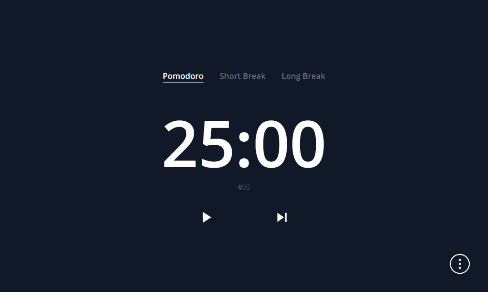
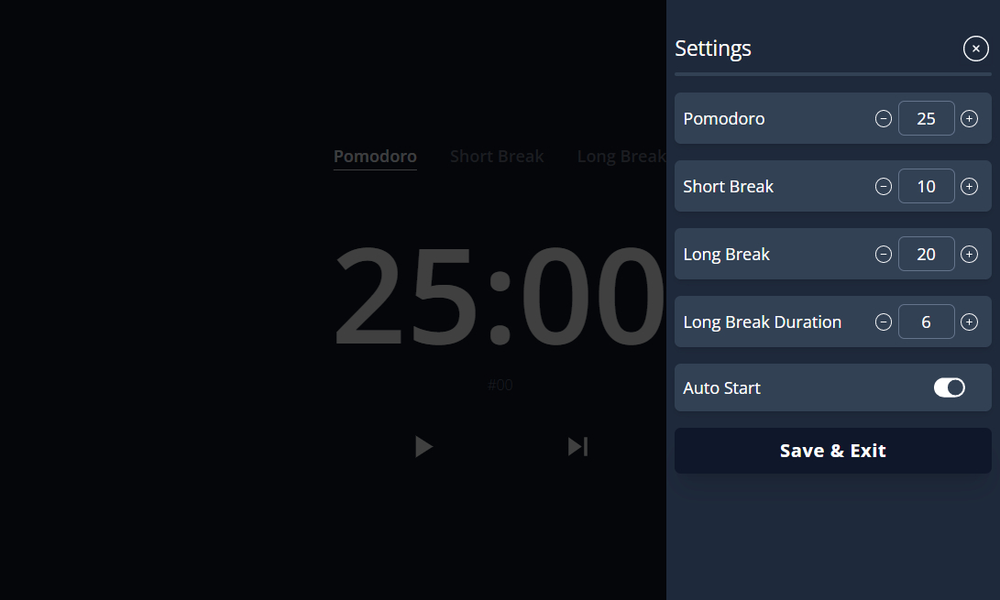

# POMODOR APP 

`Less distractions, more focus, unleash your productivity with pomodoro!.`

Based on the Pomodoro technique, our platform helps you manage your time effectively and get more done.

Our minimal design minimizes distractions, allowing you to stay focused on your tasks and achieve your goals.

Whether you're a student, freelancer, or professional, [try it](https://hacenbarb-pomodoro.netlify.app/) and discover the power of Pomodoro.

> The Pomodoro technique is a simple time management method that breaks work into intervals (25 min), called "pomodoros," separated by short breaks (5 min). and after certain pomodoros (4) you can take a long break (20 min) and so on. This approach not only boosts productivity but also reduces burnout and improves focus.

### `Used Technologies`

* React.js
* TailwindCss
* React Icons
* Day.js
* Vite

### `Learn More`

To learn more take a look at the following resources:

- [React documentation](https://reactjs.org/) - learn React.
- [TailwindCSS Documentation](https://tailwindcss.com/) - learn TailwindCSS.
- [React icons Documentation](https://react-icons.github.io/react-icons/) - learn React-icons.
- [Day.js Documentation](https://day.js.org/docs/en/installation/installation) - learn Day.js.
- [Vite Documentation](https://vitejs.dev/guide/) - learn about Vite features.

this project is made with ♥ by <a href="https://github.com/hacenbarb" target="_blank" style="color:light-blue;text-decoration:none">@hacenbarb</a>

